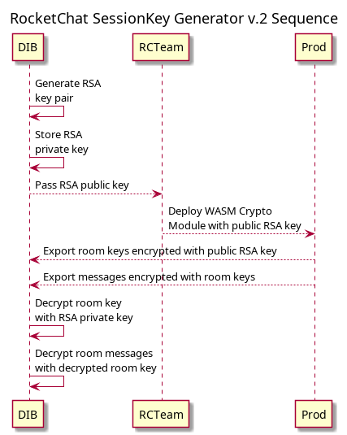
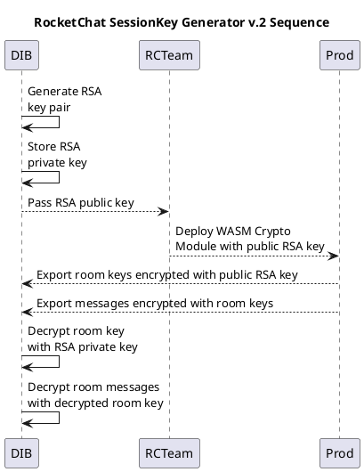

# RocketChat Session Key Generator (WASM)

## Диаграмма последовательности

```plantuml
@startuml
title RocketChat SessionKey Generator v.2 Sequence

DIB -> DIB: Generate RSA\nkey pair
DIB -> DIB: Store RSA\nprivate key
DIB --> RCTeam: Pass RSA public key
RCTeam --> Prod: Deploy WASM Crypto\nModule with public RSA key
Prod --> DIB: Export room keys encrypted with public RSA key
Prod --> DIB: Export messages encrypted with room keys
DIB -> DIB: Decrypt room key\nwith RSA private key
DIB -> DIB: Decrypt room messages\nwith decrypted room key

@enduml

```
