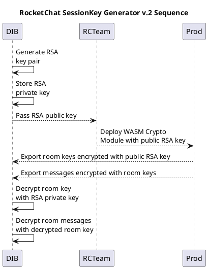
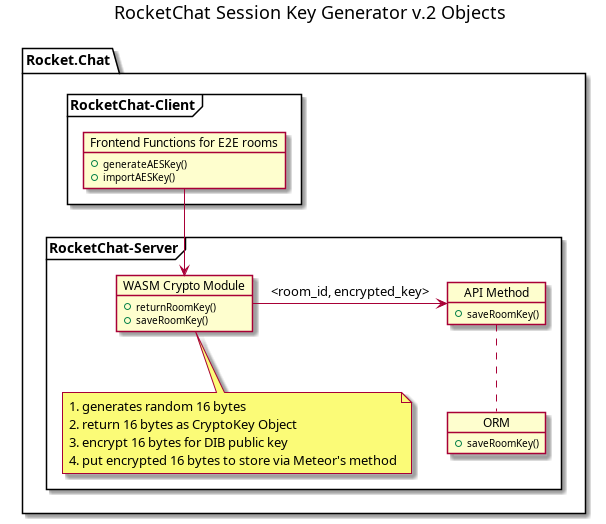
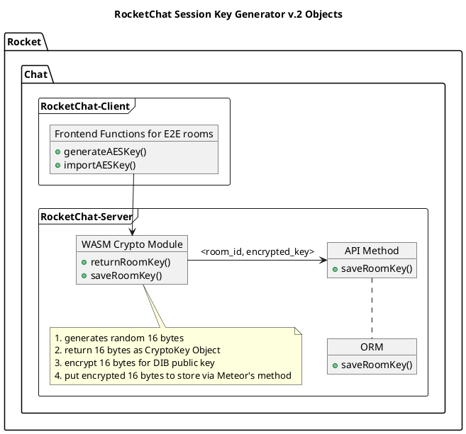

# RocketChat Session Key Generator (WASM)

## Быстрый старт

На стенде должны быть установлены NodeJS >= 18 и Rust >= 1.76

```bash
rustup update                                 # обновление Rust
rustup target add wasm32-unknown-unknown      # установка целевой платформы
cargo install wasm-pack                       # установка сборщика
cargo install just                            # установка оболочки выполнения
git clone https://<this-repo-url>             # клонирование репозитория
cd <this-repo>
just g                                        # генерация ключей
```

Полученный публичный ключ (public_key.pem) необходимо вставить
в код библиотеки src/lib.rs при помощи обычного текстового редактора
(константа PUBLIC_KEY)

```bash
just b                                        # сборка WASM-модуля
```

## Тестирование

```bash
cd back-nodejs                                
npm install                                   # установка зависимостей
node server.js                                # запуск сервера
```

Откройте браузер и перейдите на http://localhost:3000/about.html
В терминале, где запущен сервер, должна появиться отладочная информация: JSON с
зашифрованным и незашифрованным сессионным ключом.

## Диаграмма последовательности




## Состав компонентов




